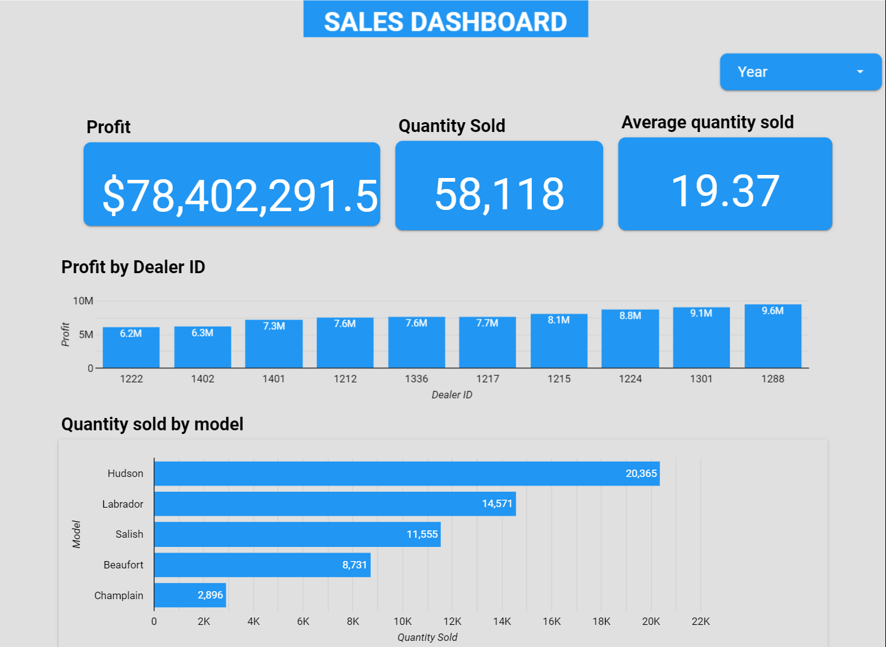

# LOOKER STUDIO VISUALISATION

 Dashbord Visualisation of car sales and profits for a SwiftAuto Traders, a chain of car dealerships.

 ## About the Data Sources

The dataset used in this lab comes from here in the IBM Accelerator Catalog. The Terms of use for such are located at [https://developer.ibm.com/terms/ibm-developer-terms-of-use/]. 

## Project Description

This project present some KPIs of car sales and profit on a dashboard designed with Looker Studio.

## Steps to Reproduce

1. **Export Data** :
   -> Use the provided CSV Data files in this repository.

2. **Create Visualizations**:
   -> Use Looker Studio to create visualizations based on the data by following these steps:
        (1)Capture Profit (formatted to 1 decimal place in millions of US dollars); (2)Capture Quantity sold; 
        (3)Create a bar chart to capture Quantity sold by model; (4)Capture Average quantity sold

4. **Results**:
   Below is a screenshot of the sales dashboard in Looker Studio
     -  

## Contact

For any questions, please contact [ME] at [pamenbrenda@hotmail.com].

Analysing car sales and profits for each dealer and presenting result as a dashboard/report
